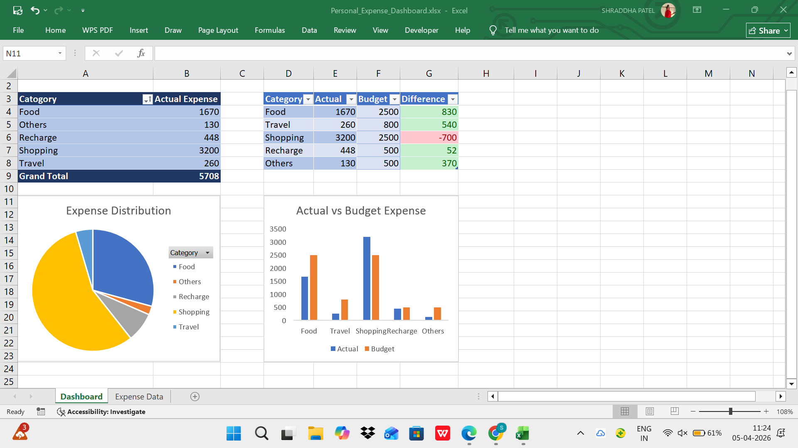

# Personal Expense Dashboard (Excel)

This project is an Excel-based dashboard designed to track and analyze personal expenses.

## 📊 Features

* Expense tracking by category
* Budget vs Actual comparison
* Difference analysis (Savings / Overspending)
* Data visualization using charts (Bar & Pie Charts)

## 🛠 Tools Used

* Microsoft Excel
* Pivot Tables
* Charts

## 📈 Project Overview

This dashboard helps in understanding spending patterns and managing personal finances effectively. It provides insights into where the most money is spent and highlights areas of overspending or savings.

## 📸 Dashboard Preview

